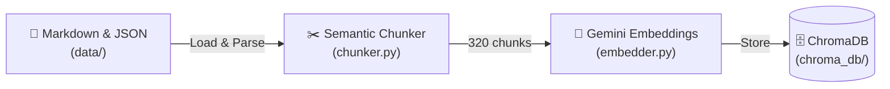
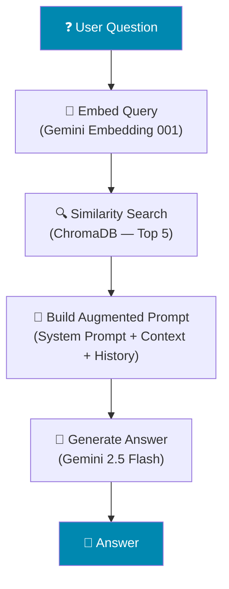
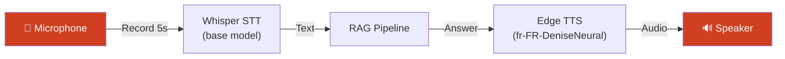
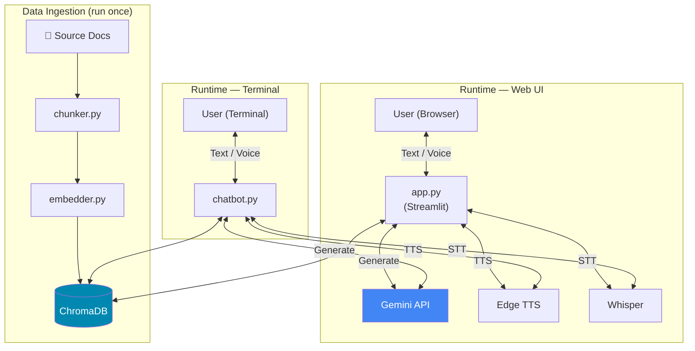
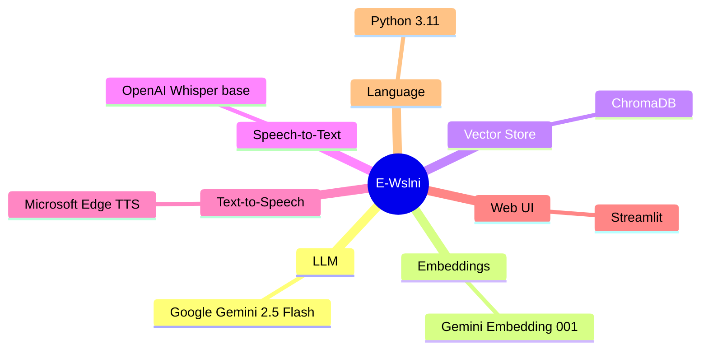

<div align="center">

# 🤖 E-Wslni — EMINES / UM6P Campus Assistant

**An AI-powered campus guide chatbot built with RAG, Voice I/O & Streamlit**

[](https://python.org)
[](https://ai.google.dev/)
[](https://streamlit.io)
[](#license)

</div>

---

## 📌 Overview

**E-Wslni** is a Retrieval-Augmented Generation (RAG) chatbot that answers questions about **EMINES – School of Industrial Management** and the **Université Mohammed VI Polytechnique (UM6P)**. It is designed to be integrated into an autonomous campus-guide robot.

> The chatbot retrieves relevant knowledge from a local vector store and generates grounded, factual answers — never hallucinating information.

---

## ✨ Features

| Feature | Description |
|---|---|
| 🧠 **Semantic RAG** | Retrieves relevant chunks from ChromaDB and generates grounded answers with Gemini |
| 🌍 **Multilingual** | Responds in the same language as the question (French, English, Arabic…) |
| 🎤 **Voice Input** | Speech-to-text with OpenAI Whisper — speak your questions |
| 🔊 **Voice Output** | Text-to-speech with Microsoft Edge TTS — free, high-quality, no API key |
| 💬 **Web Interface** | Streamlit app with sidebar voice controls, per-message "Listen" button, and source display |
| 🖥️ **Terminal Mode** | Text or voice chat loops for headless / robot deployment |
| 🧾 **Conversation Memory** | Keeps the last 5 exchanges for context-aware follow-up answers |

---

## 🏗️ Architecture

### Data Pipeline



### RAG Query Flow



### Voice Pipeline



### System Overview



---

## 📁 Project Structure

```
e-wslni/
├── chunker.py          # Step 1 — Load and semantically chunk Markdown/JSON docs
├── embedder.py         # Step 2 — Embed chunks with Gemini and store in ChromaDB
├── chatbot.py          # Step 3 — Terminal chatbot (text + voice modes)
├── app.py              # Streamlit web interface
├── requirements.txt    # Python dependencies
├── .env                # API key (not committed)
├── data/               # Source documents (Markdown, JSON)
│   ├── *.md            # Markdown knowledge files
│   └── emines_docs.json
└── chroma_db/          # ChromaDB vector store (auto-generated)
```

---

## 🔧 Prerequisites

- **Python 3.10+**
- A [Google Gemini API key](https://aistudio.google.com/apikey) (free tier is sufficient)
- A working **microphone** and **speakers** (for voice mode)

---

## 🚀 Setup

```bash
# 1. Clone the repository
git clone https://github.com/RedaMohssine/E-Wslni---Chatbot-Robot-Guide.git
cd E-Wslni---Chatbot-Robot-Guide

# 2. Create and activate a virtual environment
python -m venv venv
# Windows
venv\Scripts\activate
# macOS / Linux
source venv/bin/activate

# 3. Install dependencies
pip install -r requirements.txt

# 4. Create the .env file with your API key
echo GOOGLE_API_KEY=your_key_here > .env
```

---

## 📖 Usage

### 1. Build the vector store (first time only)

```bash
python chunker.py     # Chunk the source documents
python embedder.py    # Embed and store in ChromaDB
```

### 2. Terminal chatbot

```bash
python chatbot.py
# Choose 1 for text mode, 2 for voice mode
```

### 3. Web interface

```bash
streamlit run app.py
```

Open the URL printed in the terminal (default: `http://localhost:8501`).

---

## ⚙️ Configuration

| Variable | Location | Default | Description |
|---|---|---|---|
| `GOOGLE_API_KEY` | `.env` | — | Gemini API key |
| `LLM_MODEL` | `chatbot.py` / `app.py` | `gemini-2.5-flash` | Generation model |
| `EMBEDDING_MODEL` | `embedder.py` | `gemini-embedding-001` | Embedding model |
| `TOP_K` | `chatbot.py` / `app.py` | `5` | Chunks retrieved per query |
| `TTS_VOICE` | `app.py` | `fr-FR-DeniseNeural` | Default Edge TTS voice |

---

## 🛠️ Tech Stack



---

## 🗺️ Roadmap

- [x] Semantic chunking pipeline
- [x] RAG with Gemini
- [x] Conversation memory
- [x] Voice input (Whisper STT)
- [x] Voice output (Edge TTS)
- [x] Streamlit web interface
- [ ] Arabic language optimization
- [ ] Integration with physical robot (ROS2)
- [ ] Admin panel for knowledge base management
- [ ] Multi-campus support

---

## 📄 License

This project is for educational and research purposes at UM6P / EMINES.

---

<div align="center">

**Built with ❤️ at [UM6P](https://www.um6p.ma) / [EMINES](https://www.emines-ingenieur.org)**

</div>
